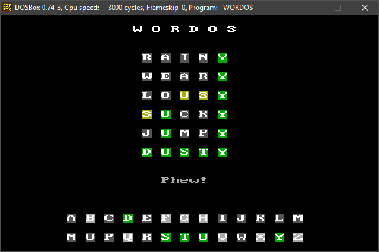

# WorDOS - a Wordle clone for DOS

Features:
* a single 40-kilobyte COM file
* contains **all** 12972 words of the original Wordle game
* same daily puzzle as in original Wordle
* should run on any machine with a slightly IBM-compatible BIOS and DOS 2.x (report a bug if it doesn't!)
* written in 100% 8086 assembly (no C)
* runs in 40x25 color text mode
* on EGA/VGA systems, dark gray ba
* **no** stats saving

## Building

Building requires Python 3 and [YASM](https://yasm.tortall.net).

On Unix, just run `make`, or `make WORDSOURCE=nyt` to get the "censored" New York Times version of the word list instead of the classic one.

On Windows, run `build` or `build nyt`. YASM will be downloaded automatically if needed, but Python 3 must be installed system-wide.

## Running

Fire up `wordos.com` in your favorite emulator, or copy it to some disk and run it on the real thing! As said, it should "just work", but if you encounter any compatibility issues, drop me a note and I'll see if I can fix it.

## Playing

Enter five letters, confirm your entry by pressing Enter, rinse and repeat. After solving the puzzle or exhausting all six guesses, the game will quit after pressing any key. It can also be quit at any time using the Escape key.

## FAQ

### How is this related to [vitawrap/WORDOS](https://github.com/vitawrap/WORDOS)?

Not related at all, except that vitawrap and me were obviously inspired by the same ideas and chose the same name (and display mode) for our ports. I learned about their WOR-DOS only after my WorDOS was done.

### Where can I download the COM file?

On the GitHub page, click on the [latest release](https://github.com/kajott/wordos/releases/latest) in the right sidebar and download `wordos.com` from there.

### Why?

Because I can! Seeing all the Wordle ports sprouting left and right, I thought I'd give it a try too.

### Why assembly instead of C?

Because assembly is a lot of fun, and Wordle is a simple enough game to be implemented in assembly in three evening sessions. Sure, with C, it could have been a single day, but where's the fun in that?

Besides, I always like minimalistic approaches and I hate all forms of bloat. If I used a C runtime, I guess I'd get an extra 10k of code size simply because of that.

### How did you cram all 13k words into a 40k file?

By using fancy encoding: there are 26^5 = 11.9 million possible four-letter English words, which fits nicely into three bytes per word. No further compression is used; the word list really is a raw 39k blob in the 40k executable.

### Why doesn't the daily puzzle match that of the official website?

There are two potential reasons: First, you may simple have the wrong date on the DOS side, as not all DOSes are Y2K compliant. Second, keep in mind that the default build of WorDOS uses the _classic_ word list from the old powerlanguage.co.uk website, **not** the new list from the New York Times website.

### How can I get more than one puzzle per day?

Well, obviously you can change the DOS date between sessions. However, there *might* be another way hidden in the source code ... a secret key maybe?

## Contact

* Mail: [keyj@emphy.de](mailto:keyj@emphy.de)
* Twitter: [KeyJ_trbl](https://twitter.com/KeyJ_trbl)
